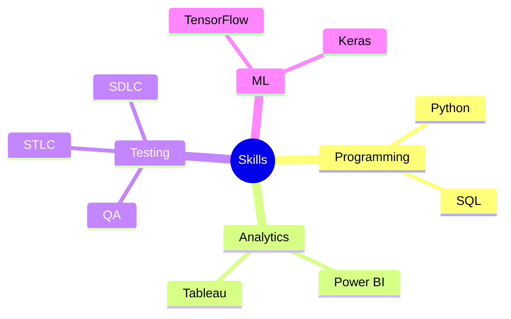

````md
<div align="center">


# 👋 Hi, I'm Ajeet Rawat

### MCA Graduate | Aspiring IT Professional


</div>

---

# 🚀 About Me

🎓 MCA Graduate from Graphic Era Hill University

💼 Internship experience in XML Validation & Quality Assurance

📊 Interested in Data Analytics, Software Testing and Business Intelligence

🌱 Constantly learning new technologies and building projects

📍 Dehradun, Uttarakhand, India

---

# 🎯 Career Interests

- Data Analytics
- Software Testing
- Business Intelligence
- Technical Support
- IT Operations
- Technology Driven Roles

---

# 🛠 Tech Stack

<div align="center">


</div>

### Languages & Databases

- Python
- SQL
- MySQL
- SQLite

### Data Analytics

- Power BI
- Tableau
- Advanced Excel
- Pandas
- NumPy
- Matplotlib

### Testing & QA

- Manual Testing
- Functional Testing
- Regression Testing
- STLC
- SDLC
- Bug Reporting

### Tools

- Jira
- Postman
- Jupyter Notebook
- Google Colab
- VS Code
- PyCharm

---

# 💼 Internship Experience

## XML Intern | Way2Class Pvt. Ltd.

📅 Jan 2026 – Jun 2026

### Responsibilities

- XML Validation
- DTD Validation
- Error Resolution
- XML Compilation
- IEEE Journal Processing
- Quality Assurance
- LaTeX to XML Conversion

---

# 🚀 Featured Projects

## 🍎 Apple Leaf Disease Prediction

**Tech Stack:** Python, TensorFlow, Keras, Flask

- CNN model trained on 2000+ images
- Disease classification system
- Real-time prediction using Flask

---

## 🛡️ GuardConnect Security Job Portal

**Tech Stack:** Python, Flask, SQLite

- Client Module
- Agency Module
- Job Seeker Module
- Authentication System
- Job Management System

---

## 📊 Super Store Sales Dashboard

**Tech Stack:** Power BI

- Sales Analysis
- KPI Dashboard
- Revenue Tracking
- Profit Insights

---

# 📈 Project Overview


---

# 🧠 Skills Map



---

# 📜 Certifications

🏆 Google Advanced Data Analytics

🏆 IBM Machine Learning

🏆 SQL for Data Science

---

# 🌱 Currently Learning

* Advanced SQL
* Power BI
* Data Analytics
* Software Testing
* Business Intelligence

---

# 📬 Connect With Me

<p align="center">

<a href="mailto:rawatajeet59@gmail.com">

</a>

<a href="https://linkedin.com/in/ajeet-rwt">

</a>

<a href="https://github.com/Ajeetrwt2002">

</a>

</p>

---

<div align="center">

### ⭐ Learning • Building • Growing ⭐

</div>


```
```
